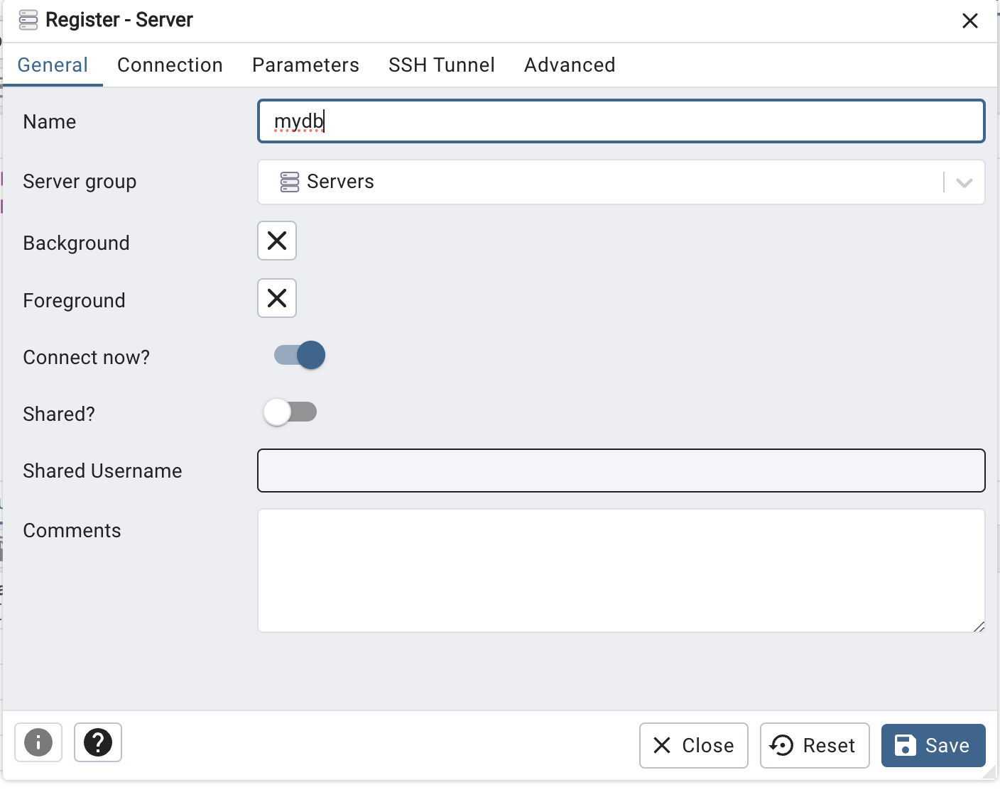
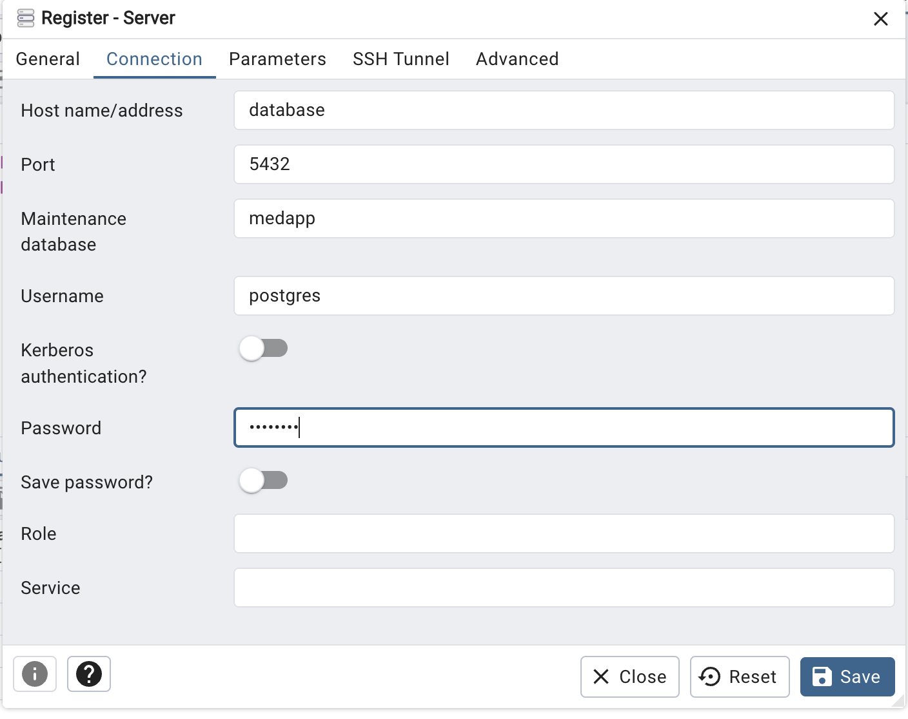
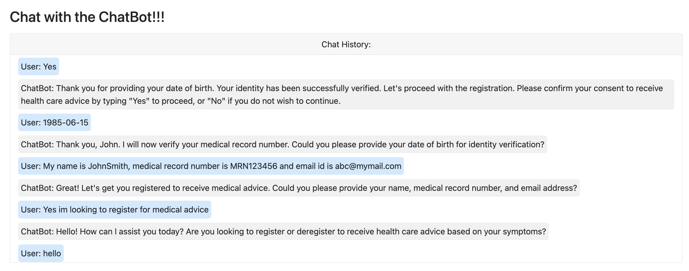
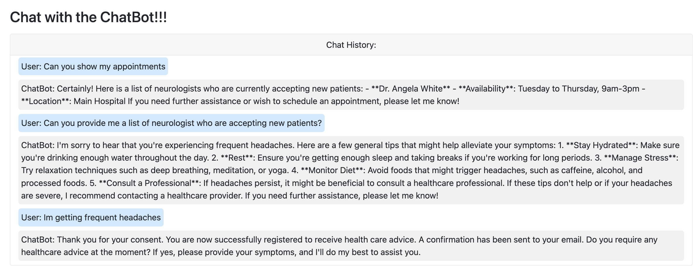
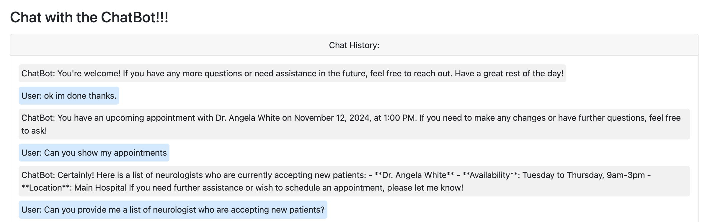

# `MediWise Chatbot`
Medical Chat Assistant.

DISCLAIMER: Do not use this for actual medical advice.  This was made by computer science students for a team project.

Built using:

`OpenAI` - LLM

`Fastapi` - framework for building API's.

`Uvicorn` - Web server implementation in Python

`Jinja2` - templating for creating HTML.

`Bootstrap 5` - html, css and javascript toolkit for developing UI.

`Pinecone VectorDB` - Used for storing KnowledgeBase embedding for context search based on simillarity. `Note`: Before using the app make sure to create Pinecone account and create your Apikey.

# Installing Docker on Windows
- Download Docker from [the official site](https://www.docker.com/products/docker-desktop/) and run it
- If you're not using an administrator account, run Computer Management as an administrator, navigate to Local Users and Groups\Groups\docker-users (should be near the bottom of the last directory), right-click and add your user to the group (the name is how it appears in C:\Users) ([source](https://stackoverflow.com/questions/58663920/can-i-run-docker-desktop-on-windows-without-admin-privileges))
- You may have to restart your computer to make Docker run properly once all the prior steps are completed

# Setting up Local Postgres DB
- For setting up local `postgres` we are going to use `Docker`
- `Pre-Req` make sure to have Docker installed on your machine
- Execute `docker compose up -d` to install postgres DB and pgAdmin(web based UI tool for managing Postgres DB)
- To access the postgres DB using pgAdmin goto `http://localhost:5050/`
- Once you open the URL above, login with the creds under the pgAdmin section in the docker compose to login.
- Then click add server and give a `name` to the server
  
- Switch over to the connection tab and enter these details to establish the connection to the local postgres DB. Under password enter the db password value (it is `password` , you can get it from the docker compose file as well.)
  
- Once you are successfuly connected then you should be able to create tables under the `medapp` database and populate then with the test data.
- `Note`: As you are creating tables and populating data using pgAdmin, to make spinning up the database with all the data everytime we rebuild our project and not having to rebuild the tables and populate them again, I suggest adding the sql statements to the file i created under the `sql` folder in our project.  This ensures everytime we rebuild our project we have our local database ready with all the existing data.

# How to Use the Bot from `Browser`
- Clone the repo to your machine
- Open terminal and then `cd` into the repo.
- Do `python -V` with a capital V to verify you are on version 3.10 or later.  If not, uninstall old versions or change the PATH variables
- Make a virtual environment in a folder called venv using `python -m venv .\venv`
- Start the venv it using `.\venv\Scripts\activate`
- From the terminal execute `python -m pip install -e .` to install the package on your machine.
- If that doesn't work, execute `python -m pip install --upgrade pip` and try again
- Create a .env file in the root directory of the repo
- In the first line of the .env file, put put your API key instead of `{your_key}` in `OPENAI_API_KEY={your_key}`
- In the second line of the .env file, put put your API key instead of `{your_key}` in `PINECONE_API_KEY={your_key}`
- execute `uvicorn mediwise_chatbot.main:app --host 127.0.0.1 --port 8001 --reload`
- uvicorn will host the application at `http://127.0.0.1:8001`

# How to Use the Bot from `Terminal`
- Clone the repo to your machine
- Open terminal and then `cd` into the repo.
- Do `python -V` with a capital V to verify you are on version 3.10 or later.  If not, uninstall old versions or change the PATH variables
- Make a virtual environment in a folder called venv using `python -m venv .\venv`
- Start the venv using `.\venv\Scripts\activate`
- From the terminal execute `python -m pip install -e .` to install the package on your machine.
- If that doesn't work, execute `python -m pip install --upgrade pip` and try again
- Create a .env file in the root directory of the repo
- In the first line of the .env file, put put your API key instead of `{your_key}` in `OPENAI_API_KEY={your_key}`
- In the second line of the .env file, put put your API key instead of `{your_key}` in `PINECONE_API_KEY={your_key}`
- execute `chatbot`

# How to `Contribute`

- Create a `feature` branch from `main` .
- Make your changes in the `feature` branch.
- Push the `feature` to github.
- Create a Pull Request to the `main` from the `feature` branch when your changes are fully tested and ready to be merged to `main`.

# Maintaining `requirements.txt`

If you had to install any new python package to develop a new feature then please make sure the package along with its version is included in the `requirements.txt` file. Doing this will ensure other contributors can pull the latest code, install the package locally and start the app without any issues.

# Sample Chat Conversation

# `Note`

Do not commit your api keys or any personal details.

# `Resources`
- [Planning and User Stories](https://lucid.app/lucidspark/40dc780b-0a4b-4243-ae61-28290dc36111/edit?invitationId=inv_a7c6313a-3322-4a40-92af-773b961cd35c&page=0_0#)